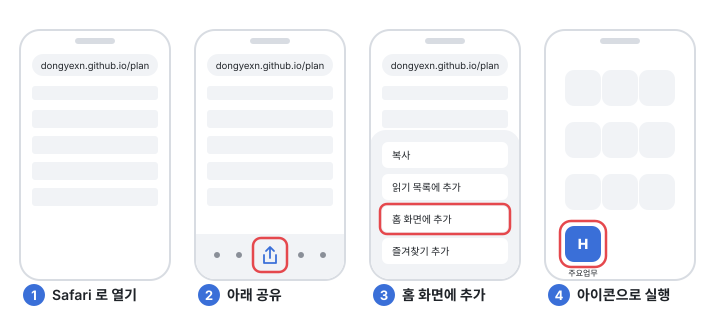
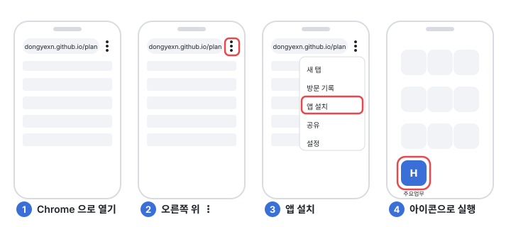

# 사용 안내: H · 주요업무현황

주소 `dongyexn.github.io/plan` · 회사 메일(`@hdec.co.kr`)로 로그인 · 브라우저 · 바탕화면 위젯 · 휴대전화

## 1. 시작하기

1. 회사 메일로 가입하고 **인증 메일의 링크**를 누른다.
2. 관리자에게 팀·담당 현장 배정을 요청한다.
3. (PC) 설정 → 바탕화면 위젯을 내려받아 실행한다. 위젯이 곧 이 앱이다.

### 휴대전화에 설치

설치 파일은 없다. 주소를 열고 홈 화면에 추가하면 앱처럼 열린다.

**아이폰**: 꼭 Safari 로 연다(크롬·네이버 앱에서는 메뉴가 없다).

**안드로이드**: Chrome 또는 삼성 인터넷.

## 2. 캘린더

날짜를 누르면 그날 업무가, 여러 날을 끌면 그 기간이 잡힌다. 「+」로 업무를 넣는다. **저장 버튼이 없다**: 적는 대로 저장되고, 그만두려면 오른쪽 위 X.

- **완료**: 팀 공통 업무는 기한이 지나면 저절로 완료. 담당자 업무는 다음 날 「놓친 업무 확인」 창이 떠서 완료 · 오늘로 · 날짜 변경 중 고른다. 손대지 않고 닫으면 **보류함**으로 간다.
- **보류함**: 일자 패널 아래. 달력 날짜로 끌어다 놓으면 그 날로 되살아난다.
- **반복 업무**: 매주 · 격주 · 매월 · 매년. 회차마다 완료하고, 회차 하나만 옮기거나 뺄 수 있다.
- **우클릭**: 날짜: 업무 추가 · 휴무일 지정(관리자). 업무: 완료 · 수정 · 복사 · 삭제.
- **찾기**: 맨 위 검색창 또는 `Ctrl+K`. 업무 · 현장 · 하자를 한 번에.
- 완료 6개월이 지난 업무는 보관함으로 옮겨진다(지워지지 않는다, 검색하면 나온다).

## 3. 업무 현황

왼쪽 위에서 **주간 업무 ↔ 현장별 업무**. 줄을 누르면 그 자리에서 고친다.

- **주간 업무**: 보고 주기는 목요일 ~ 수요일. 이번 주기 완료와 다음 주기 예정을 나란히.
- **현장별 업무**: 그 달 업무를 현장별로. 날짜와 현장이 둘 다 있는 업무만 나온다.
- 업무 구분 중 **고위험**은 제목 앞에 느낌표 표시가 붙는다.

## 4. 업무 도구

D+60 점검만 팀이 함께 쓰는 기록(서버)이다. 나머지는 이 PC 브라우저에만 저장돼 새로고침해도 이어서 하고, 올린 파일은 서버로 가지 않는다. 지우려면 도구마다 「초기화」. 파일은 화면에 끌어다 놓아도 열린다.

### D+60 점검

준공 두 달 뒤 초기 품질 점검. 준공일이 있는 현장이 저절로 목록에 들고, 점검일은 준공일 + 2개월(고칠 수 있다).

- **폰에서 점검**: 현장 → 공종 → 전유부(세대) · 공용부 · 민원사항 → 공간 → 항목마다 양호 · 지적 · N/A. 지적이면 조치사항이 열리고 기본값이 들어 있다. 옆으로 밀면 다음 공간.
- **사진**: 판정 줄 오른쪽 카메라. 항목당 4장. 안드로이드는 원본이 바로 갤러리에, 아이폰은 판정을 누를 때 뜨는 시트에서 「이미지 저장」.
- **남은 항목 양호**: 공간 안에서 아직 판정 안 한 항목을 한 번에 양호로. 폰은 항목 아래 단추, 데스크톱은 표 머리 단추.
- **되돌리기**: 판정·지우기·남은 항목 양호는 알림의 「되돌리기」나 Ctrl+Z 로 한 단계씩 되돌린다.
- **점검 완료**: 상단바 「점검 완료」를 누른 공종이 완료(미확인이 남아도 된다). 다시 누르면 해제.
- **현장에 없는 공간**: 점검 화면에서 숨긴다(그 현장만).
- **데스크톱**: 현장 표에서 판정·조치사항을 바로 고치고, 엑셀 · 인쇄 · 「사진대지」로 낸다. 폰은 상단바 엑셀만.
- **서식**: 데스크톱 왼쪽 위 「서식」에서 공간·항목을 고친다. 통째로 바꿀 땐 설정 → D+60 점검 서식(관리자).

### 사진대지 작성

사진을 A4 한 장에 2·4·6칸으로 앉혀 인쇄한다. 파일명에서 위치·내용을 읽고, 두 번 클릭으로 자르고, 네모 · 원 · 화살표 · 번호 · 모자이크로 표시한다. 고른 사진은 한꺼번에 90° 돌린다. 삭제·자르기·돌리기·표시 모두 Ctrl+Z 로 되돌린다.

### 견적 검토

업체 산출서의 산출 근거 열을 붙여넣으면 줄마다 계산식을 검산해 정답 · 오답 · 제외로 나눈다. 결과 줄을 두 번 누르면 원문 그 줄로 가고, 고치면 결과가 바로 다시 나온다. 결과는 우클릭으로 복사한다.

### 재하자 추적 · 생산성 검토

「전체 하자 목록」 엑셀(사내 보안 파일은 CSV 로 저장해서)을 열어, 완료 뒤 다시 접수된 건과 외주 처리 효율을 본다. 표 위 깔때기 단추로 열 필터를 걸면 모든 탭과 엑셀에 같이 걸린다.

### 도면 인쇄

DWG 를 열면 도면틀마다 한 장으로 나눠 A4 · A3 로 인쇄한다. 레이어를 골라 끌 수 있고, 읽는 중에는 취소할 수 있다.

## 5. 하자처리 현황

관리자가 설정에서 HCS 원본을 올리고 [등록]하면 팀 전원이 게시된 현황을 본다. 숫자는 모두 **기준월 말일** 기준.

- **대시보드**: 팀 합계와 현장별 접수 · 처리 · 미처리 · 장기미처리.
- **현장**: 종합 · 장기미처리 · 공가 · 상세 · 민원 현황 탭. 처리계획은 여기서 적으면 팀 전체에 반영된다.
- **민원 현황**: 세대별로 양호 · 주의 · 경계 · 심각 · 긴급 다섯 단계(접수 내용의 정해진 규칙으로 판정: AI 아님).
- **목록 보기**: 열 머리 클릭 정렬 · 우클릭 필터 · 피벗 · 엑셀.

## 6. 조직 · 권한

조직 관리에서 팀 · 권역 · 현장 · 계정을 관리한다(관리자).

| 직급 | 권역 | 담당 현장 | 보는 범위 |
|---|---|---|---|
| 팀장 · 안전 · 원가 |: |: | 팀 전체 |
| 공구장 | 지정 |: | 그 권역 |
| 담당자 | 지정 | 지정 | 그 현장 |

- 새로 가입한 사람은 계정 탭 끝 **미배정**에 있다.
- 현장 표 토글: **인수인계**(끄면 인수 전: 하자 대시보드에서 빠짐) · **하자현황**(끄면 하자 화면에서 숨김) · 공가 · 소제기.
- 역할: 관리자(editor)는 조직·설정까지, 사용자(viewer)는 업무 작성까지, 차단(blocked)은 로그인 불가.

## 7. 바탕화면 위젯

반투명 창으로 달력을 띄운다. 날짜를 누르면 앱과 같은 업무 패널이 옆에 뜬다. 켜면 하루 한 번 오늘 업무 알림, 오후 5시 이후 남은 업무 알림(위젯 설정에서 끈다). 창 위치·크기는 설정의 「위치·크기 조정」을 켠 동안만 바뀐다.

## 8. 백업 (관리자)

관리자 계정으로 위젯을 켜 두면 주 1회 `문서\H 주요업무현황\backup\` 에 저절로 저장된다. 설정 → 백업에서 내보내기 · 불러오기, 지운 업무는 **휴지통**(30일). 백업에는 업무 · 보관함 · 담당자 · D+60 서식과 점검 결과가 들어간다. 되돌릴 때 팀·권역·현장과 점검 사진은 제외된다.

## 9. 문제가 생기면

| 증상 | 조치 |
|---|---|
| 저장이 안 됨 | 관리자에게 계정 권한 확인 |
| 화면이 옛 모습 | `Ctrl+Shift+R` · 폰은 아이콘을 지우고 다시 추가 |
| 위젯이 안 뜸 | `문서\H 주요업무현황\HPlanWidgetLite.exe` 실행 |
| 원인을 알릴 때 | 설정 → 백업·기록 → **복사** → 관리자에게 |

시스템 · 배포 · 내부 규칙은 [dev.md](dev.md).
